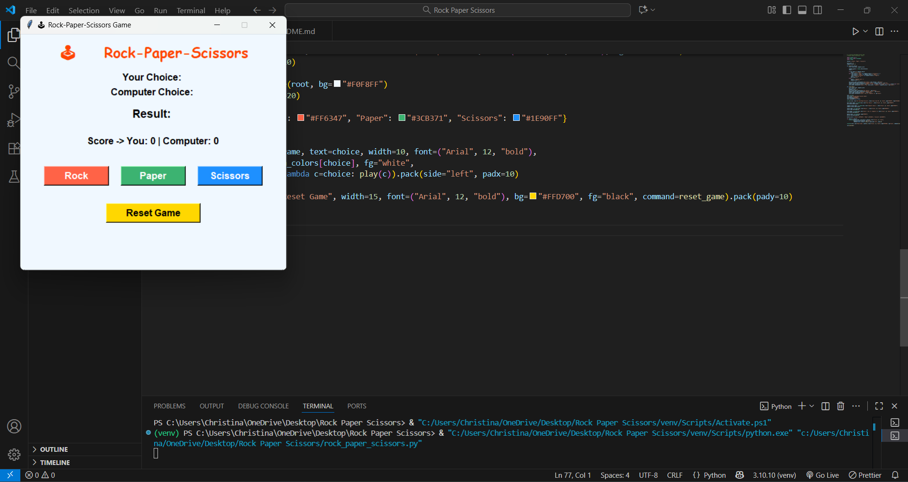

# 🕹️ Rock-Paper-Scissors GUI Game

**Codsoft Python Internship - Task 3**

A **colorful and interactive Rock-Paper-Scissors game** built using Python's Tkinter library. This project is designed as part of the **Codsoft Python Programming Internship** and demonstrates GUI development, game logic, and user interaction.

---

## 🔹 Features

- Interactive **buttons** for Rock, Paper, and Scissors  
- Shows **user choice** and **computer choice** for each round  
- **Dynamic result display**: Win, Lose, or Tie  
- **Score tracking** across multiple rounds  
- **Reset button** to restart the game  
- Colorful **GUI design** for enhanced visual appeal  

---

## 🖥️ Demo



> The screenshot shows the colorful GUI with buttons, score display, and result messages.

---

## ⚙️ How to Run

**1. Clone the repository:**
```bash
git clone https://github.com/chris73006/Codsoft_Task-3

2. Navigate to the project folder:

3. Run the Python file:

python rock_paper_scissors.py

Make sure you have Python 3 installed on your system. Tkinter comes pre-installed with Python.

📝 How It Works

1. Click a choice button (Rock, Paper, or Scissors).

2. The computer makes a random selection.

3. The game compares choices and determines the result.

4. Scores are updated dynamically.

5. Use the Reset Game button to start fresh.

💡 Skills Demonstrated

Python programming

GUI development with Tkinter

Event handling and user input

Conditional logic and score tracking

Polished, visually appealing project design suitable for portfolio/internship submissions

🔗 GitHub Repo

https://github.com/chris73006/Codsoft_Task-3

📌 Tags

#Python #GUI #Tkinter #Internship #Codsoft #Portfolio #Projects #RockPaperScissors
